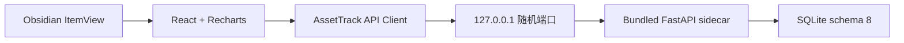

# 架构

## 当前运行链



| 层 | 当前职责 |
|---|---|
| Obsidian 插件 | View、Ribbon、设置、文件夹联想、sidecar 生命周期 |
| React | 草稿、表格交互、导航保护和实时图表 |
| Python | API、校验、财务公式、SQLite、备份恢复 |
| SQLite | 唯一持久化事实 |

sidecar 只监听 loopback，使用一次性 bootstrap token 换取 session。插件持续消费
stdout/stderr，传入 Obsidian 父进程 PID，并在卸载时请求 shutdown。

## 数据路径

用户必须在 Vault 内选择 Asset_Track 根目录。插件设置只保存 Vault 相对根目录，
数据库始终解析为：

```text
<Vault>/<workspacePath>/data/accounting_system.db
```

未配置时不创建 View、不启动 sidecar，也不创建数据库。切换根目录前必须处理
dirty 草稿；新位置只允许为空或包含可验证的 schema 8 数据库。

## 写入边界

- 月份、借款、规则和账户保存均携带 revision。
- 前端质检失败不发送写请求，后端再次校验。
- 月份使用单事务整体保存。
- 保存后分析重新读取服务端权威数据。
- 插件不生成 Markdown/SVG，也不自动备份。
- 手动恢复先 staging 校验，再创建当前数据库安全快照并原子替换。

## 下一主要版本

下一主要版本计划删除 Python sidecar，将 API、计算、SQLite 和备份逻辑迁移到
Obsidian 桌面运行时中的 TypeScript。迁移以现有 Python golden tests 和 schema 8
fixture 为行为基线，必须一次只替换一个边界，避免两套公式长期并存。
