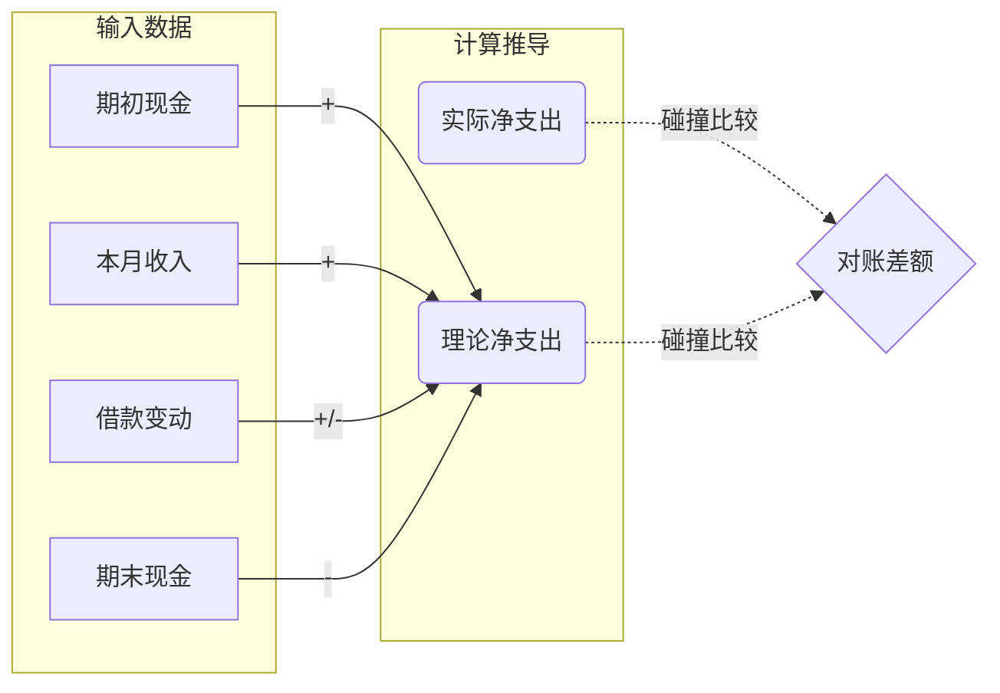

# 财务计算口径

项目的核心价值在于其财务逻辑的严密性。

## 1. 资产与对账算法 (The Truth Algorithm)
系统通过“资产状态”的变动来校验“流水记录”的完整性。



### 核心公式
- **资产大盘** = `现金合计` - `债务余额` + `理财本金`
- **对账等式**：
  `期末现金 = 期初现金 + 收入 - 净支出 + 借款变动 - 理财加仓 + 理财提现`
- **其中**：
  - `净支出 = 全部支出 - 代付/回款`
  - `借款变动 = (期末债务余额 - 期初债务余额)` (注意：债务为负代表他人欠我)

### 1.1 固定资产记录口径

`fixed_assets` 是独立的月度记录表，用于记录手机、电脑等大件资产的状态和购买价格。schema 8 已永久删除日常估值字段。

- 固定资产不计入 `total_assets`。
- 固定资产不参与理论净支出、对账差额、储蓄率或年度财务趋势。
- 月度储蓄率 = `(本月收入 - 本月净支出) / 本月收入`；收入不大于 0 的月份不计算，显示为空而不是 0%。
- 只有状态为“在用”或“闲置”的记录自动继承到下一个自然月。
- “已出售”和“已报废”保留在发生月份，用于回看历史，但不再继承。
- 固定资产的购买流水仍需按普通交易单独记录，系统不会自动建立两者关联。

### 三步核验法
1. **实际净支出**：基于流水中标记为“支出”的金额总和减去“代付”。
2. **理论净支出**：由上述资产变动公式推导出的逻辑支出。
3. **差额 (Discrepancy)**：二者之差。差额趋近于 0 说明当月所有资金流向已被完整记录。

## 2. 支出结构分析 (Category 2.0)
系统将分类 (Category) 赋予了元数据属性，从而支持支出质量分析。

### 两个维度
- **必要性维度**：
    - **生存必要**：如工作餐、日用品。
    - **可控消费**：如娱乐、大件产品。
- **消费频率维度**：
    - **周期**：如房租、订阅。反映按月、按年或固定周期出现的生活承诺。
    - **日常**：如基础餐饮、餐饮改善、通勤、日用品。反映高频生活消耗。
    - **偶尔**：如生活品质、大件、社交娱乐。反映不定期或一次性消费。

### 关键指标
- **可控消费占比** = `(可控消费 / 总支出) * 100`。月度视图使用该指标判断当月是否偏“享受型”。
- 消费频率不作为月度核心判断，因为年付会员、补货类生活必需品会造成单月失真；周期/日常/偶尔的真实成本应在年度视图按年化口径审计。
- **生活杠杆率** = `可控消费支出 / 生存必要支出`。反映了每花 1 元在生存上，额外投入了多少可主动调节的生活品质支出。

## 3. 滚动数据窗口 (Trailing 12-Month)
为了解决“年初无趋势”的问题，系统采用 **Rolling 12-Month** 逻辑：
- 月度视图加载以当前月为终点的 **过去 13 个月** 数据，用于跨月对账和历史分类差异计算。
- 年度视图以该年度最后一个有数据月份为终点展示 **过去 12 个月** 趋势。
- 确保了财务观察的连续性，不再受自然年边界的束缚。

## 4. 当前代码中的精确计算口径

核心计算位于 `backend/assettrack/domain/calculator.py`。智能体维护时应以代码中的字段口径为准。

### 4.1 月度流水汇总 `calc_monthly(tx_df)`

```text
all_out          = SUM(amount WHERE type == "支出")
total_daifu      = SUM(amount WHERE type == "代付")
total_expense    = all_out - total_daifu
total_income     = SUM(amount WHERE type == "收入")
total_deposit    = SUM(amount WHERE type == "加仓")
total_withdraw   = SUM(amount WHERE type == "提现")
```

注意：
- 当前实现把 `代付` 作为实际净支出的抵扣项。
- 当前导入流程只接受 `支出 / 收入 / 代付 / 加仓 / 提现` 五种类型。
- `代付` 参与 `total_daifu` 抵扣；`加仓` 与 `提现` 参与理论净支出推导，但不会进入 LLM 分类统计。

### 4.2 支出结构分析

结构分析基于 `backend/assettrack/infrastructure/config.py` 的 `CATEGORIES_METADATA`：

```text
necessary  = 必要支出
controlled = 可控支出
periodic   = 周期支出
daily      = 日常支出
occasional = 偶尔支出
```

当前大件识别规则：
- 分类元数据包含 `is_big_ticket: True`；或
- 单笔支出金额 `amount >= 1000`。

### 4.3 借款余额 `calc_debt_for_month(month)`

借款记录按月份动态生效，不写入月度快照表。

```text
active debt condition:
start_date <= month_end
AND (is_paid = 0 OR paid_date > month_end)

debt_balance = SUM(active_debt.amount)
```

语义：
- `amount > 0`: 我欠别人，是负债。
- `amount < 0`: 别人欠我，是资产。
- 在还清日期所在月份的月末，该笔借款已经不再计入余额；当前借款余额只统计尚未还清的记录。
- `total_assets = cash - debt + principal`。

这个公式中，如果 `debt` 为负数，则 `cash - debt` 会自然增加资产。

## 5. 跨月递推与连续月份保护

`build_annual_df()` 不会对不连续月份强行计算差额。它先检查上一行是否确实是当前月份的前一个月：

```text
prev_month_valid =
    (current_month - 1 day).strftime("%Y-%m") == previous_row.month
```

只有 `prev_month_valid == True` 时才计算：

```text
cash_delta           = cash - previous_cash
asset_delta          = total_assets - previous_total_assets
inv_profit_delta     = inv_profit - previous_inv_profit
debt_change          = debt - previous_debt
theoretical_expense  = previous_cash + total_income + debt_change - cash - total_deposit + total_withdraw
discrepancy          = total_expense - theoretical_expense
```

这意味着：
- 首月没有对账基准。
- 中间缺月时，该月不会产生理论消费与对账差额。
- 年度视图会额外加载上一年 12 月，用于自然年 1 月的跨年对账。

## 6. 资产与理财口径

当前系统区分三个理财相关概念：

```text
principal     = 投入本金
market_value  = 持仓市值
cash_balance  = 理财账户内流动资金
inv_position  = market_value + cash_balance
inv_profit    = inv_position - principal
inv_roi       = inv_profit / principal * 100
inv_weight    = market_value / inv_position * 100
```

注意：
- `资产大盘 / total_assets` 使用的是 `principal`，不是 `inv_position`。
- 理财收益通过 `inv_profit` 单独展示。
- 这样设计可以避免市值波动直接污染“本金口径”的资产大盘，但也意味着总资产并不等于现金 + 借款净额 + 理财当前市值。
- 跨月和年度趋势只展示 `principal`（理财投入）；`market_value`、`cash_balance`、`inv_position`、`inv_profit` 和 `inv_roi` 仅用于解释某个月的理财快照，不作为动态资产趋势。

## 7. 对账差额的解释建议

在 UI 和文档中解释 `discrepancy` 时，应保持以下口径：

```text
discrepancy = 实际净支出 - 理论净支出
```

- `discrepancy ≈ 0`: 流水、资产快照、借款、理财变动基本闭合。
- `discrepancy > 0`: 流水记录的支出大于资产倒推支出，可能存在漏记收入、资产快照偏高、支出类型误标。
- `discrepancy < 0`: 资产倒推支出大于流水记录支出，可能存在漏记消费、少导账单、资产快照偏低、理财加仓/提现漏标。

不要把差额解释成绝对错误；它是排查入口，需要结合资产快照、账单完整性和特殊交易类型判断。
